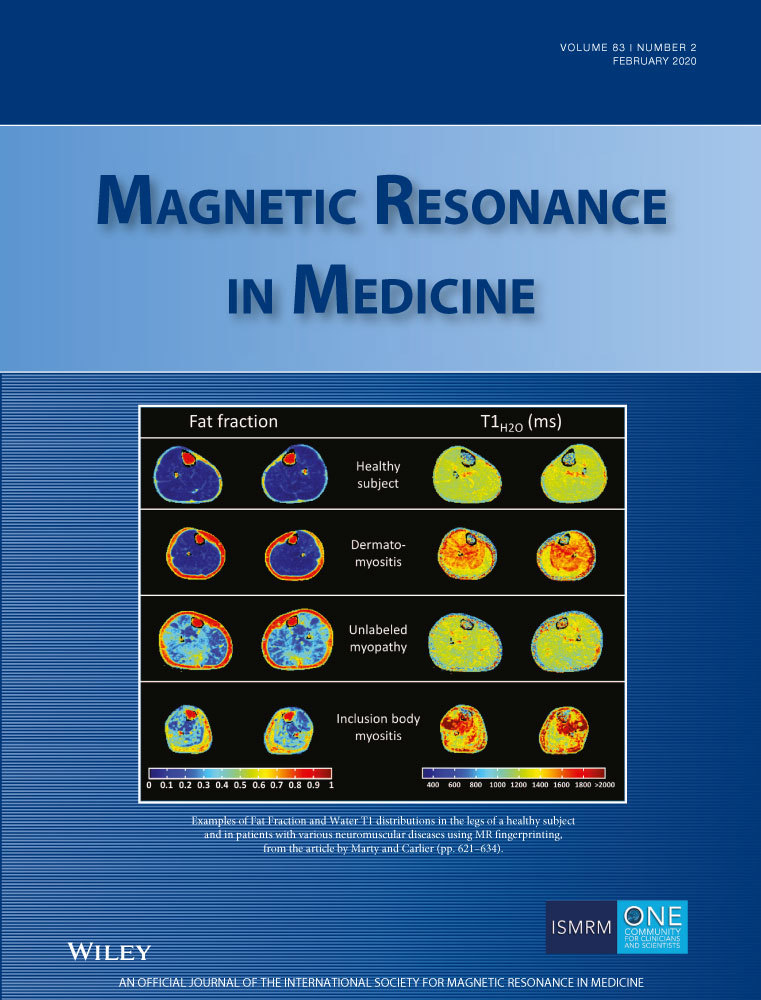

# Automatic in‐line quantitative myocardial perfusion mapping:   Processing algorithm and implementation

Hui Xue1 | Louise A.E. Brown2 | Sonia Nielles‐Vallespin3 | Sven Plein2 |
Peter Kellman1   

1National Heart, Lung and Blood Institute, National Institutes of Health, Bethesda, Maryland   

2Multidisciplinary Cardiovascular Research Centre (MCRC) & Leeds Institute of Cardiovascular and Metabolic Medicine, University of Leeds, Leeds,
United Kingdom   

3Royal Brompton Hospital, London, United Kingdom      
 

> **⚠ Note:**  
> Paper: https://onlinelibrary.wiley.com/doi/abs/10.1002/mrm.27954     
> Code: https://github.com/xueh2/QPerf   

## Correspondence   
Hui Xue, National Heart, Lung and Blood
Institute, National Institutes of Health, 10
Center Drive, Bethesda, MD 20892.
Email: hui.xue@nih.gov   
## Funding information
Supported by the National Heart, Lung
and Blood Institute, National Institutes of
Health.   